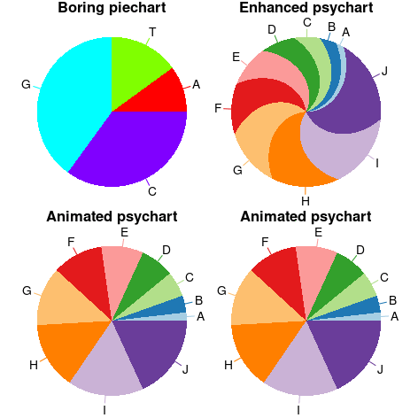

```{r setup, include=FALSE}
knitr::opts_chunk$set(echo = TRUE)
```


## Load library
```{r lib}
library(psychart)
```

## Generate some data and plot simple psychart
```{r demo1}
d = c(A=10,T=15,G=40,C=35)
par(mfrow=c(1,2),tck=-0.02,mgp=c(1.1,0.2,0),mar=c(0,0,1,0),oma=c(0,1,0,1))
psychart(d,main='Boring pie-chart')
psychart(d,spiral.shift = 120,main='Enhansed psy-chart')
```
## Multiple psypies on same plot
```{r sameplot}
d = c(A=10,T=15,G=40,C=35)
par(mfrow=c(1,1),tck=-0.02,mgp=c(1.1,0.2,0),mar=c(0,0,1,0),oma=c(0,1,0,1))
plot(1,t='n',axes=FALSE,ann=FALSE,xlim=c(0,20),ylim=c(0,5))
psychart(d,spiral.shift = 120,radius = 0.8,center = c(1,1),new=FALSE)
psychart(d,spiral.shift = 20,radius = 1,center = c(4,2),new=FALSE,norm.radius = F,border='black')
d1 = setNames(1:10,LETTERS[1:10])
col1 = RColorBrewer::brewer.pal(10,'Paired')
psychart(d1,col=col1,
         spiral.shift = 320,radius = 3.4,center = c(14,2),new=FALSE,norm.radius = TRUE,tck.length = 0.1)

```

## Make it animated
```{r animate1}
dir.create('tmp',showWarnings = F)
for(i in 0:80){
	png(paste0('tmp/',1000+i,'.png'),width = 12,height = 12,units = 'cm',res = 150)
	par(mfrow=c(2,2),tck=-0.02,mgp=c(1.1,0.2,0),mar=c(0,0,1,0),oma=c(0,1,0,1))
	a = i*10
	psychart(d,spiral.shift = 0,init.angle= 0,main='Boring piechart')
	psychart(d1,col=col1,spiral.shift = 60,init.angle= 0,main='Enhanced psychart')
	psychart(d1,col=col1,spiral.shift = a,init.angle=-a,main='Animated psychart')
	psychart(d1,col=col1,spiral.shift = a,init.angle= 0,main='Animated psychart')
	dev.off()
}
```
## Compile gif
```{r animate2}
require(magick)
imgs = list.files('tmp', full.names = TRUE)
img_list = lapply(c(imgs[-length(imgs)],rev(imgs[-1])), image_read)
img_joined = image_join(img_list)
img_animated = image_animate(img_joined, fps = 10,optimize = TRUE)
image_write(image = img_animated,
            path = "animated.gif",
            quality = 10)
```

